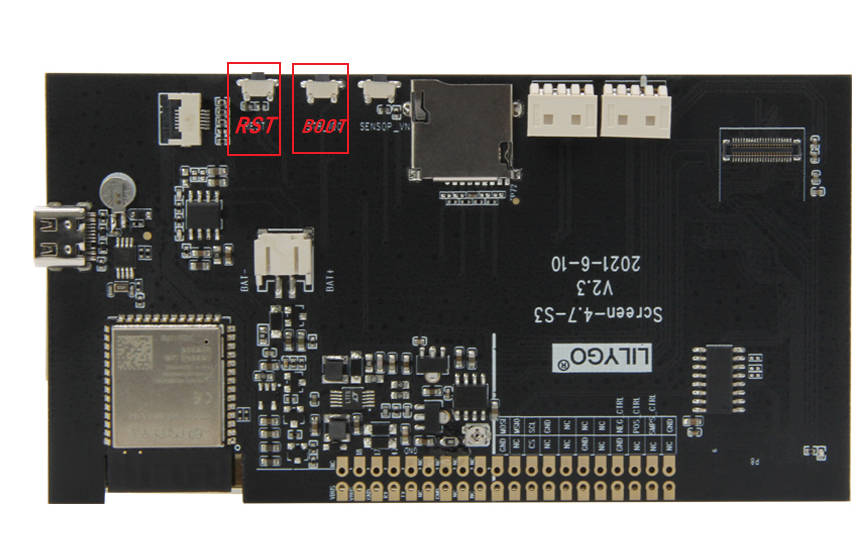

<h1 align = "center">🌟LilyGo EPD47 🌟</h1>

<!-- ## **English | [中文](./README_CN.MD)** -->

## News

- The driver and sample program are from [vroland/epdiy](https://github.com/vroland/epdiy)

## 1️⃣Support Product

| Product(PinMap)   | SOC        | Flash | PSRAM    | Resolution | Size     |
| ----------------- | ---------- | ----- | -------- | ---------- | -------- |
| [T5-ePaper-S3][1] | ESP32-S3R8 | 16MB  | 8MB(OPI) | 960x540    | 4.7 Inch |

| Current consumption | Working current             | sleep current | sleep mode    |
| ------------------- | --------------------------- | ------------- | ------------- |
| [T5-ePaper-S3][1]   | (240MHz) WiFi On 90~230+ mA | About 380uA   | button wakeup |

[1]: https://www.lilygo.cc/products/t5-4-7-inch-e-paper-v2-3

## 2️⃣Examples

```txt
examples/
├── button              ; Keystroke example
├── demo                ; Comprehensive test example including sleep current test
├── drawExample         ; Simple examples of drawing lines and circles
├── drawImages          ; Show image example
├── grayscale_test      ; Grayscale example
├── screen_repair       ; Full screen refresh example
├── spi_driver          ; Display as slave device
├── touch               ; Touch example
└── wifi_sync           ; WiFi Comprehensive Example
```

## 3️⃣ PlatformIO Quick Start (Recommended)

1. Install [Visual Studio Code](https://code.visualstudio.com/) and [Python](https://www.python.org/)
2. Search for the `PlatformIO` plugin in the `VisualStudioCode` extension and install it.
3. After the installation is complete, you need to restart `VisualStudioCode`
4. After restarting `VisualStudioCode`, select `File` in the upper left corner of `VisualStudioCode` -> `Open Folder` -> select the `LilyGo-EPD47` directory
5. Wait for the installation of third-party dependent libraries to complete
6. Click on the `platformio.ini` file, and in the `platformio` column
7. Uncomment one of the lines `src_dir = xxxx` to make sure only one line works
8. Click the (✔) symbol in the lower left corner to compile
9. Connect the board to the computer USB
10. Click (→) to upload firmware
11. Click (plug symbol) to monitor serial output
12. If it cannot be written, or the USB device keeps flashing, please check the **FAQ** below

## 4️⃣ Install from Arduino Library Manager (recommended)

1. Install [Arduino IDE](https://www.arduino.cc/en/software)
2. Install [Arduino ESP32 V 2.0.5 or above and below V3.0](https://docs.espressif.com/projects/arduino-esp32/en/latest/) ，recommended to use version 2.0.15, the URL is as follows 
    Steps: Arduino IDE -> Preferences -> Additional boards manager URLs
    ```url
    https://espressif.github.io/arduino-esp32/package_esp32_index.json
    ```
3. `Sketch` -> `Include Library` -> `Manage Libraries`
4. `Library Search` -> `LilyGo EPD47` -> `Install` -> `Install ALL`
5. `File` -> `Examples` -> `LilyGo EPD47` -> `Any Examples`
6. `Tools` , Look at the picture to choose
   | Arduino IDE Setting                  | Value                             |
   | ------------------------------------ | --------------------------------- |
   | Board                                | **ESP32S3 Dev Module**            |
   | Port                                 | Your port                         |
   | USB CDC On Boot                      | Enable                            |
   | CPU Frequency                        | 240MHZ(WiFi)                      |
   | Core Debug Level                     | None                              |
   | USB DFU On Boot                      | Disable                           |
   | Erase All Flash Before Sketch Upload | Disable                           |
   | Events Run On                        | Core1                             |
   | Flash Mode                           | QIO 80MHZ                         |
   | Flash Size                           | **16MB(128Mb)**                   |
   | Arduino Runs On                      | Core1                             |
   | USB Firmware MSC On Boot             | Disable                           |
   | Partition Scheme                     | **16M Flash(3M APP/9.9MB FATFS)** |
   | PSRAM                                | **OPI PSRAM**                     |
   | Upload Mode                          | **UART0/Hardware CDC**            |
   | Upload Speed                         | 921600                            |
   | USB Mode                             | **CDC and JTAG**                  |

   - The options in bold are required, others are selected according to actual conditions.

7. Select `Port`
8. Click `upload` , Wait for compilation and writing to complete
9.  If it cannot be written, or the USB device keeps flashing, please check the **FAQ** below


## 5️⃣ Related Projects

- [OpenWeather Display](https://github.com/Xinyuan-LilyGO/LilyGo-EPD-4-7-OWM-Weather-Display/tree/web)
- [EPD47-HC08](https://github.com/Xinyuan-LilyGO/EPD47-HC08.git)
- [Variometer](https://github.com/Oganisyan/Variometer-LilyGoEPD47)


# 6️⃣ ESP32 basic examples

- [BLE Examples](https://github.com/espressif/arduino-esp32/tree/master/libraries/BLE)
- [WiFi Examples](https://github.com/espressif/arduino-esp32/tree/master/libraries/WiFi)
- [SPIFFS Examples](https://github.com/espressif/arduino-esp32/tree/master/libraries/SPIFFS)
- [FFat Examples](https://github.com/espressif/arduino-esp32/tree/master/libraries/FFat)
- For more examples of esp32 chip functions, please refer to [arduino-esp32-libraries](https://github.com/espressif/arduino-esp32/tree/master/libraries)

# 7️⃣ FAQ

1. Which one does the sleep current measurement example use? ?

    Sleep current test measured by [demo](./examples/demo/demo.ino) example

2. How to fix afterimages?

    Please upload [examples/screen_repair](./examples/screen_repair) to try to remove afterimages.
    It is not 100% able to remove afterimages.

3. The board uses USB as the JTAG upload port. When printing serial port information on USB_CDC_ON_BOOT configuration needs to be turned on.
If the port cannot be found when uploading the program or the USB has been used for other functions, the port does not appear.
Please enter the upload mode manually.
   
   

   1. Connect the board via the USB cable
   2. Press and hold the BOOT(IO0) button , While still pressing the BOOT(IO0) button, press RST
   3. Release the RST
   4. Release the BOOT(IO0) button
   5. Upload sketch
   
