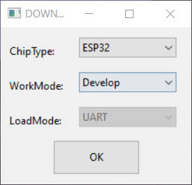
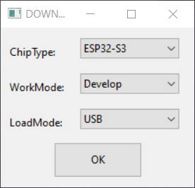
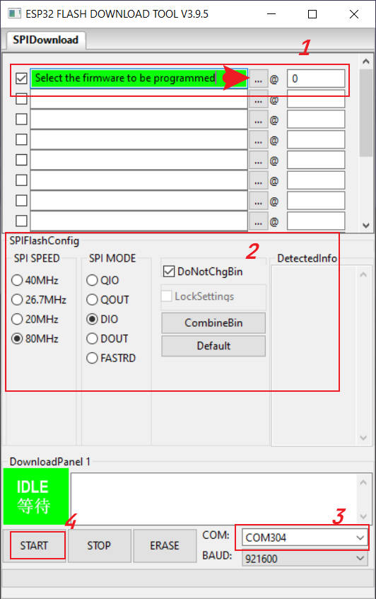
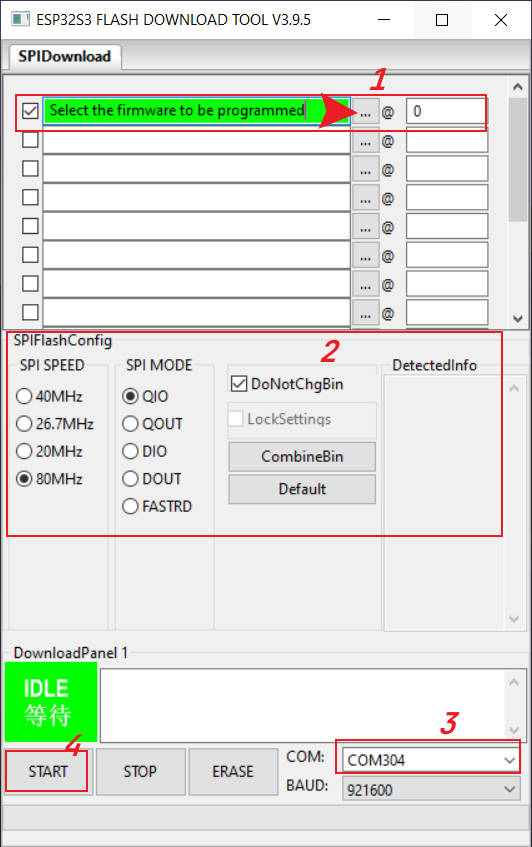

# 1. Firmware

1. `T5-4.7-plus_no_touch_firmware.bin` T5-4.7 ESP32S3 no touch Test
2. `T5-4.7-plus_touch_firmware.bin` T5-4.7 ESP32S3 with touch Test
3. `T5-4.7_firmware.bin`  T5-4.7 ESP32  Test firmware

# 2. Tools Dowload

- [Flash_download_tool](https://www.espressif.com.cn/sites/default/files/tools/flash_download_tool_3.9.5_0.zip)

| Step   | T5-4.7           | T5-4.7-Plus        |
| ------ | ---------------- | ------------------ |
| Step 1 |  |  |
| Step 2 |  |  |

